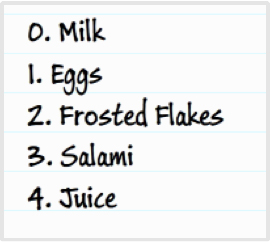
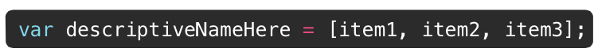
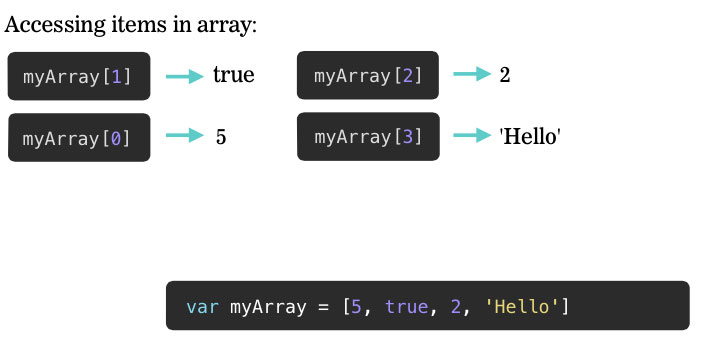
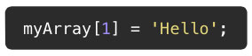
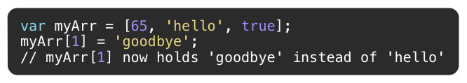
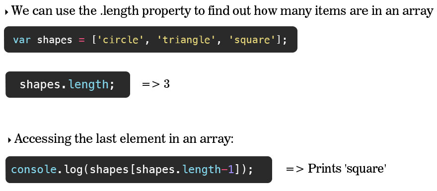

##Lesson 11 - Review & Arrays

###Arrays

---

---

####Storing Lists of Values

- An array can be used to store a list of values in a single variable
- Holds an ordered collection of values
- Can hold numbers, strings, even other arrays!
- Good for things like a grocery list, a list of states, or any other list

---

####Declaring Arrays

---

####Accessing Items in an Array

---

####Adding A Value/Replacing a Value

#####Inserting A New Value

We can insert new values into any space in the array using the positions index

#####Updating Values

If there’s already an item at that position, it will be replaced with the new value

---

####Length

